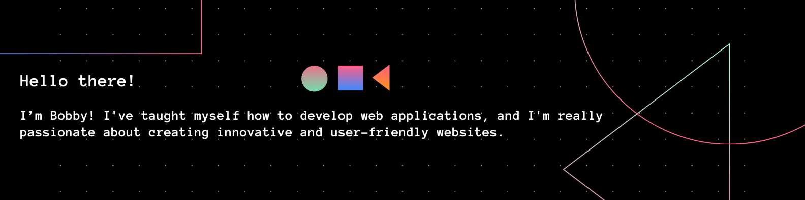

#### My tech stack:

      

- 🌱 Love photography and currently picking up some Norwegian!
- 🔭 Constantly exploring new technologies and striving to improve my skills. Check out my repositories to see what I've been working on. Let's collaborate and create something amazing together!

<!--
**bbm2910/bbm2910** is a ✨ _special_ ✨ repository because its `README.md` (this file) appears on your GitHub profile.

Here are some ideas to get you started:

- 🔭 I’m currently working on ...
- 🌱 I’m currently learning ...
- 👯 I’m looking to collaborate on ...
- 🤔 I’m looking for help with ...
- 💬 Ask me about ...
- 📫 How to reach me: ...
- 😄 Pronouns: ...
- ⚡ Fun fact: ...
-->
